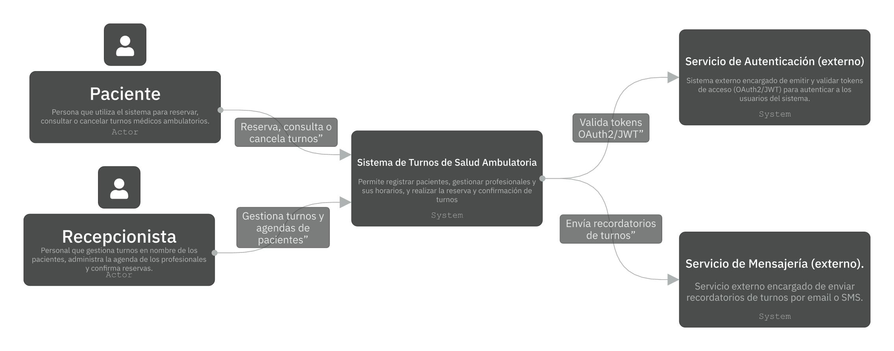
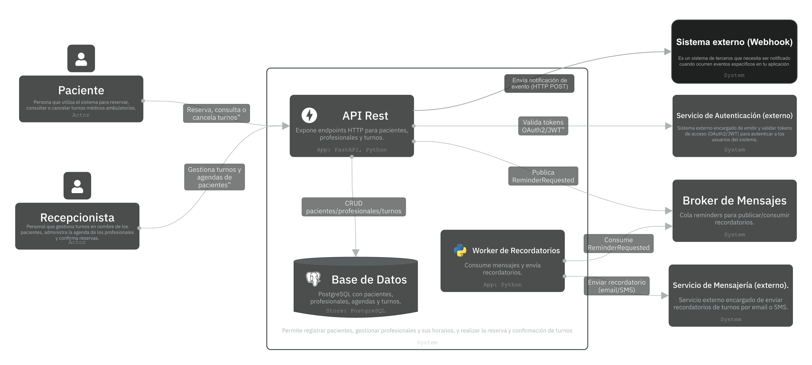
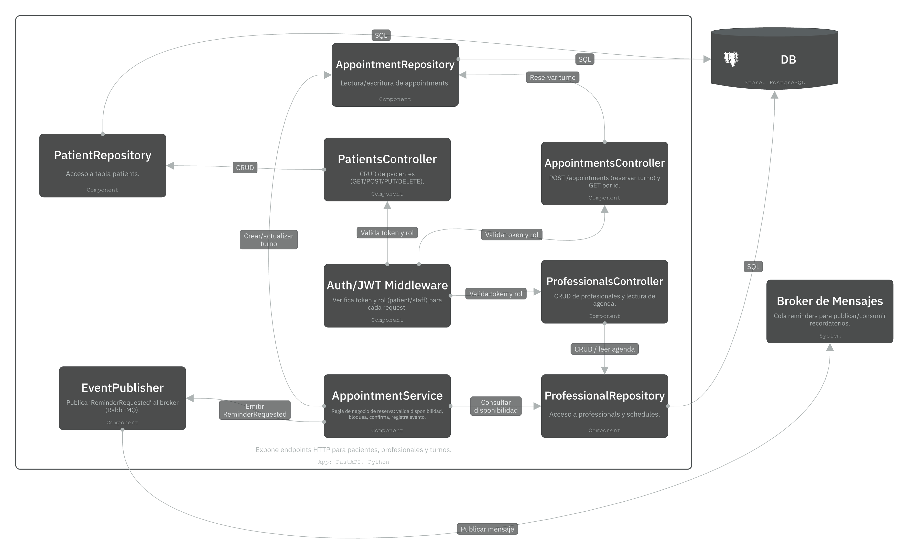
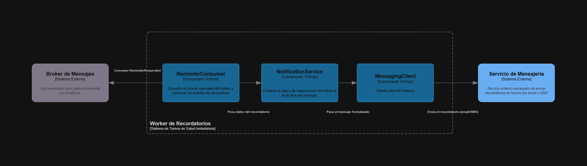

##  Diagramas C4 — Arquitectura del Sistema

A continuación se presentan los diagramas del modelo **C4**, que describen la arquitectura del sistema de **Reserva de Turnos de Salud Ambulatoria**.  
Los diagramas están divididos en tres niveles: **Contexto**, **Contenedores (Containers)** y **Componentes**.

---

### 🔹 C1 — Diagrama de Contexto

**Propósito:**  
Mostrar cómo se relaciona el sistema principal con los actores humanos y los sistemas externos.  
Representa el flujo general de interacción: los pacientes y recepcionistas usan el sistema para gestionar turnos, que a su vez se apoya en servicios externos de autenticación y mensajería.



**Elementos principales:**
- **Actores:** Paciente, Recepcionista.  
- **Sistema:** Sistema de Turnos de Salud Ambulatoria.  
- **Sistemas externos:** Servicio de Autenticación (OAuth2/JWT) y Servicio de Mensajería (recordatorios vía email/SMS).  

---

### 🔹 C2 — Diagrama de Contenedores

**Propósito:**  
Detallar los contenedores lógicos y físicos que componen el sistema y cómo se comunican entre sí y con sistemas externos.  
Se muestran los servicios desplegables y las dependencias tecnológicas principales.



**Contenedores internos:**
- **API REST (FastAPI / Python):** expone los endpoints HTTP y valida tokens.  
- **Worker de Recordatorios (Python Worker/Celery):** procesa eventos asincrónicos y envía notificaciones.  
- **Base de Datos (PostgreSQL):** persiste pacientes, profesionales, agendas y turnos.

**Sistemas externos:**
- **Servicio de Autenticación:** emite y valida tokens OAuth2/JWT.  
- **Broker de Mensajes (RabbitMQ):** cola `reminders` para comunicación asincrónica.  
- **Servicio de Mensajería:** envía emails o SMS de recordatorio.

**Relaciones clave:**
- Paciente/Recepcionista → API REST: operaciones de reserva y consulta.  
- API REST ↔ Base de Datos: operaciones CRUD.  
- API REST → Broker de Mensajes: publicación de eventos `ReminderRequested`.  
- Worker → Broker de Mensajes: consumo de recordatorios.  
- Worker → Servicio de Mensajería: envío de notificaciones.

---

### 🔹 C3 — Diagrama de Componentes (API REST)

**Propósito:**  
Mostrar la estructura interna de la aplicación principal (API REST), sus capas lógicas y cómo se integran entre sí.



**Componentes internos:**
- **Auth/JWT Middleware:** valida tokens y roles.  
- **Controllers:** gestionan las peticiones HTTP.  
  - `PatientsController` — CRUD de pacientes.  
  - `ProfessionalsController` — CRUD y consulta de agenda.  
  - `AppointmentsController` — creación y consulta de turnos.  
- **AppointmentService:** lógica de negocio para reservar turnos y emitir eventos.  
- **Repositories:** acceso a datos (Patients, Professionals, Appointments).  
- **EventPublisher:** publica `ReminderRequested` al broker RabbitMQ.

**Dependencias externas:**
- **Base de Datos (PostgreSQL):** operaciones SQL.  
- **Broker de Mensajes (RabbitMQ):** envío de mensajes asincrónicos.

**Flujo resumido de la transacción “Reservar Turno”:**
1. El cliente llama al endpoint `POST /appointments`.  
2. `Auth/JWT Middleware` valida token y rol.  
3. `AppointmentService` verifica disponibilidad y crea el turno.  
4. Se guarda en la base de datos y se publica el evento `ReminderRequested`.  
5. El worker asíncrono procesa el recordatorio y envía la notificación.

---

### 🔹 C3 — Diagrama de Componentes (Worker de Recordatorios)
**Propósito:**
Mostrar la estructura interna del servicio asíncrono. Su única responsabilidad es procesar los pedidos de recordatorios (generados por la API) y enviarlos a los pacientes a través de un servicio externo.



**Componentes internos:**
- **ReminderConsumer:** Es el punto de entrada. Se conecta al bróker, consume los mensajes Reminder:Requested y pasa los datos del turno al servicio de notificación.
- **NotificationService:** Contiene la lógica de negocio. Recibe los datos, formatea el texto final del mensaje y se lo entrega al cliente de mensajería.
- **MessagingClient:** Actúa como adaptador. Recibe el mensaje formateado y realiza la llamada API al Servicio de Mensajería (externo) para despachar el email/SMS.

**Dependencias externas:**
- **Broker de Mensajes (RabbitMQ):** Lee y consume los mensajes Reminder:Requested de la cola.
- **Servicio de Mensajería (externo):** Utiliza su API para enviar el email/SMS al paciente.

**Flujo resumido de la transacción “Enviar Recordatorio”:**
1. El ReminderConsumer consume un mensaje Reminder:Requested del Broker de Mensajes.
2. Pasa los datos del mensaje al NotificationService.
3. El NotificationService genera el texto del recordatorio y se lo pasa al MessagingClient.
4. El MessagingClient realiza la llamada API al Servicio de Mensajería (externo) para que este envíe la notificación.


## 🧱 Decisiones Arquitectónicas (ADRs)

Los **Architectural Decision Records (ADRs)** documentan las decisiones técnicas más relevantes del proyecto, junto con su contexto, justificación y consecuencias.  
Cada ADR se identifica con un número y un título breve.

---

### 🧾 ADR 0001 – Estilo de API (REST + OpenAPI)

#### 📌 Contexto  
El sistema debe exponer operaciones para gestionar **pacientes**, **profesionales** y **turnos**.  
Se necesita un contrato simple, ampliamente compatible con herramientas como **Postman** y fácil de documentar.  
Además, la consigna del trabajo práctico exige un contrato **OpenAPI 3.1**.

#### 💡 Decisión  
Implementar la interfaz principal como **API REST** sobre **HTTP**, usando **FastAPI (Python)**  
con documentación generada automáticamente en formato **OpenAPI 3.1**.

#### ✅ Consecuencias  
- Facilita las pruebas con *Postman* y la integración con otros sistemas.  
- Permite documentación interactiva en `/docs` sin esfuerzo adicional.  
- Cumple con la consigna de *OpenAPI 3.1*.  
- Es más simple que alternativas binarias o de streaming (gRPC, WebSocket).

#### 🔄 Alternativas consideradas  
- **gRPC:** más eficiente para comunicación interna, pero introduce complejidad (proto, stubs, HTTP/2).  
- **GraphQL:** flexible para consultas, pero innecesario para un CRUD clásico.  
- **SOAP:** descartado por ser obsoleto para nuevos desarrollos.

---

### 🧾 ADR 0002 – Base de Datos (PostgreSQL)

#### 📌 Contexto  
El sistema necesita almacenar información estructurada de **pacientes**, **profesionales**, **horarios** y **turnos**.  
Requiere integridad referencial (por ejemplo, que un turno siempre esté asociado a un paciente y un profesional válidos),  
transacciones seguras y facilidad de consulta para operaciones CRUD.  

También se busca compatibilidad con **Docker** y herramientas de migración reproducibles.

#### 💡 Decisión  
Utilizar **PostgreSQL 16** como base de datos principal del sistema.  
Se gestionarán las migraciones mediante herramientas como **Flyway** o **Alembic**,  
según el entorno de desarrollo.

#### ✅ Consecuencias  
- Soporta **transacciones ACID** y relaciones entre entidades.  
- Compatible con **Docker** y fácil de inicializar mediante scripts SQL.  
- Ofrece tipos avanzados (`uuid`, `jsonb`, `timestamptz`) útiles para el dominio.  
- Permite ejecutar migraciones y seeds de manera reproducible.  
- Amplio soporte en librerías ORM de Python (SQLAlchemy, asyncpg, etc.).

#### 🔄 Alternativas consideradas  
- **MongoDB:** esquema flexible, pero sin integridad referencial ni transacciones robustas.  
- **MySQL/MariaDB:** similar, pero PostgreSQL ofrece mejor soporte JSON y extensiones.  
- **SQLite:** práctico para pruebas locales, pero insuficiente para entornos concurrentes.

### 🧾 ADR 0003 – Broker de Mensajes (RabbitMQ)

#### 📌 Contexto  
El sistema requiere un mecanismo asincrónico para manejar tareas no críticas en tiempo real,  
como el envío de **recordatorios de turnos** o procesos diferidos con reintentos.  
Debe permitir comunicación desacoplada entre la API REST (productor) y el Worker de Recordatorios (consumidor).

#### 💡 Decisión  
Utilizar **RabbitMQ** como *message broker*, implementando una cola principal `reminders`  
para publicar eventos tipo `ReminderRequested` desde la API y procesarlos luego en el Worker.

#### ✅ Consecuencias  
- Permite **asincronía** sin bloquear la API principal.  
- Facilita la implementación de **reintentos automáticos** y **DLX (Dead Letter Exchange)** si fuera necesario.  
- RabbitMQ ofrece una interfaz de administración accesible (puerto `15672`) ideal para la demo.  
- Amplia documentación y soporte para **Python** (bibliotecas `aio-pika` o `pika`).

---

### 🧾 ADR 0004 – Seguridad y Autenticación (OAuth2 + JWT)

#### 📌 Contexto  
El sistema debe proteger el acceso a los endpoints de la API,  
limitando las operaciones según el tipo de usuario (**Paciente** o **Staff**).  
Además, la consigna requiere **OAuth2 + JWT** con expiración, validación y roles.

#### 💡 Decisión  
Implementar autenticación con **OAuth2 + JWT** usando **Keycloak** como servidor de identidad (IdP).  
Los tokens JWT serán firmados con **RS256**, y la API validará la firma y los *claims* mediante JWKS.  
Los roles básicos definidos serán:  
- `patient` → acceso a reservas y consultas propias.  
- `staff` → gestión de pacientes, profesionales y turnos.

#### ✅ Consecuencias  
- Cumple el estándar **OAuth2.0 / OpenID Connect**.  
- Permite manejar **expiración, scopes y roles** fácilmente.  
- Keycloak se ejecuta como contenedor adicional en Docker Compose.  
- Facilita futuras integraciones (SSO, identity federation).

---

### 🧾 ADR 0005 – Integración Externa (Webhook de Confirmación/Cancelación)

#### 📌 Contexto  
La consigna solicita implementar **una integración externa** (Webhook, gRPC o WebSocket).  
El sistema de turnos debe poder **notificar confirmaciones o cancelaciones** a un sistema externo de forma automática,  
simulando un escenario de interoperabilidad.

#### 💡 Decisión  
Implementar un **Webhook HTTP firmado (HMAC-SHA256)** que envía los eventos `AppointmentConfirmed` o `AppointmentCancelled`  
hacia una URL configurada en el entorno (`WEBHOOK_URL`).  
La firma se incluye en el header `X-Signature` para validar la autenticidad del mensaje.

#### ✅ Consecuencias  
- Fácil de implementar y probar localmente con Postman o `webhook.site`.  
- Simula una integración real (callback entre sistemas).  
- No requiere infraestructura adicional como HTTP/2 o stubs binarios.  
- Escalable: se podrían agregar retries y logs de entregas fallidas.

#### 🔄 Alternativas consideradas  
- **gRPC:** comunicación binaria más eficiente, pero requiere HTTP/2 y archivos `.proto`.  
- **WebSocket:** útil para streams en tiempo real, pero innecesario para eventos puntuales.  
- **Polling HTTP:** descartado por ineficiente y no reactivo.

---

### 🧾 ADR 0006 – Estrategia de Contenerización (Docker + Compose)

#### 📌 Contexto  
El proyecto debe poder ejecutarse completo en entornos locales de forma reproducible.  
Se necesita orquestar los servicios: API, Base de Datos, Broker y Keycloak.  
La consigna exige además incluir un `docker-compose.yml` funcional.

#### 💡 Decisión  
Contenerizar cada servicio de forma independiente usando **Docker**  
y orquestarlos mediante **Docker Compose**.  
Se incluirán los siguientes contenedores:  
- `api` (FastAPI)  
- `db` (PostgreSQL)  
- `mq` (RabbitMQ)  
- `keycloak` (OAuth2)  

#### ✅ Consecuencias  
- Entorno **reproducible** con un solo comando (`docker compose up`).  
- Facilita las pruebas y defensa técnica.  
- Compatible con pipelines futuros (CI/CD).  
- Permite mantener variables en `.env` y montar scripts de migración.  

---

## ✅ Resumen de ADRs incluidos

| Nº | Título | Tecnología / Enfoque |
|----|--------|------------------------|
| 0001 | Estilo de API | REST + OpenAPI (FastAPI) |
| 0002 | Base de Datos | PostgreSQL |
| 0003 | Broker de Mensajes | RabbitMQ |
| 0004 | Seguridad | OAuth2 + JWT (Keycloak) |
| 0005 | Integración Externa | Webhook firmado (HMAC) |
| 0006 | Contenerización | Docker + Compose |

---

## ⚙️ Ejecución local y prueba del entorno

### 🧩 Requisitos previos
- **Docker Desktop** (v27 o superior)
- **Docker Compose v2**
- Memoria mínima: 4 GB asignada a Docker
- Puerto libres: `8000`, `5432`, `15672`, `8080`

---

### 🚀 Levantar los servicios
Desde la raíz del proyecto:

```bash
docker compose up --build
```
**Puede ejecutar el script** 
```bash
./run.sh
``` 
El script automáticamente elimina los contenedores actuales, levanta los de la aplicación y los muestra con `docker compose ps`